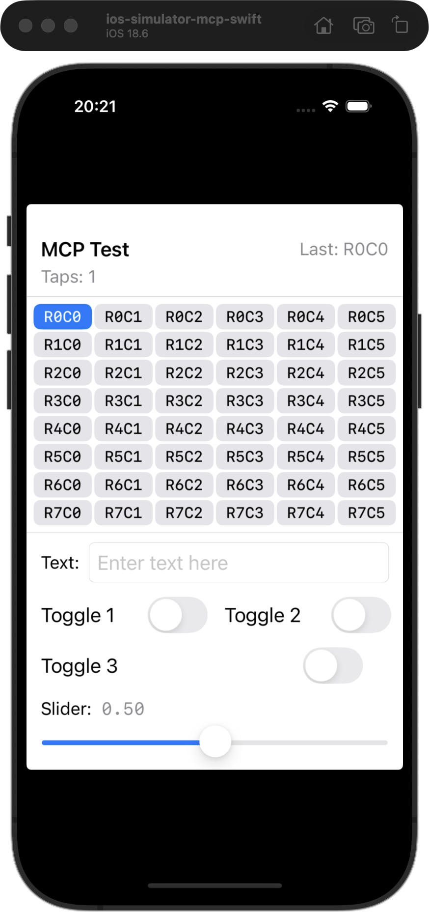
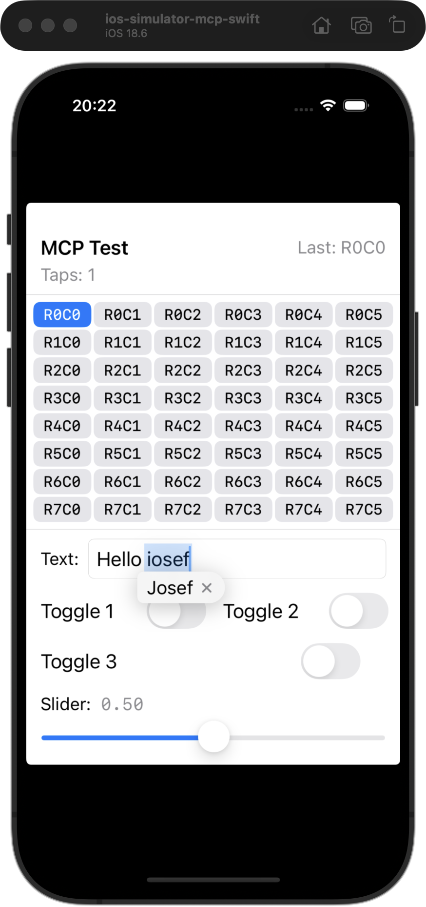

# Code Simplification — Refactored iosef Still Works

*2026-02-24T01:18:38Z by Showboat 0.6.0*
<!-- showboat-id: 14e324fd-0567-4437-a6db-69b940323bf7 -->

After splitting SimulatorMCPCommand.swift (2241 lines) into 6 focused files and applying 8 other simplifications, this demo verifies the refactored iosef binary still works correctly against MCPTestApp.

## 1. Setup — build iosef and discover the simulator

```bash
swift build -c release 2>&1 | tail -1 | sed 's/ (.*)//'
```

```output
Build complete!
```

```bash
xcrun simctl list devices booted | grep ios-simulator-mcp-swift
```

```output
    ios-simulator-mcp-swift (6C07B68F-054D-434D-B5D7-6C52DCE7D78B) (Booted) 
```

```bash
UDID=6C07B68F-054D-434D-B5D7-6C52DCE7D78B && echo "Target UDID: $UDID"
```

```output
Target UDID: 6C07B68F-054D-434D-B5D7-6C52DCE7D78B
```

Install and launch MCPTestApp on the simulator.

```bash
UDID=6C07B68F-054D-434D-B5D7-6C52DCE7D78B && APP_PATH=$(find /Users/wcybriwsky/Library/Developer/Xcode/DerivedData -name "MCPTestApp.app" -path "*/Debug-iphonesimulator/*" -type d 2>/dev/null | head -1) && xcrun simctl install "$UDID" "$APP_PATH" && echo "Installed $APP_PATH"
```

```output
Installed /Users/wcybriwsky/Library/Developer/Xcode/DerivedData/MCPTestApp-bevkpxqhnrzkddezvjsyxhhcgjnm/Build/Products/Debug-iphonesimulator/MCPTestApp.app
```

```bash
UDID=6C07B68F-054D-434D-B5D7-6C52DCE7D78B && xcrun simctl terminate "$UDID" com.mcp-test.playground 2>/dev/null; xcrun simctl launch "$UDID" com.mcp-test.playground | sed 's/: .*/: launched/'
```

```output
com.mcp-test.playground: launched
```

```bash
sleep 1 && echo "App launched, waiting for UI to settle"
```

```output
App launched, waiting for UI to settle
```

## 2. AX tree inspection — describe_all and describe_point

```bash
UDID=6C07B68F-054D-434D-B5D7-6C52DCE7D78B && .build/release/iosef describe_all --device $UDID 2>/dev/null
```

```output
AXApplication "MCPTestApp" (197±197, 426±295)
  AXGroup "MCP Test Playground" (61±46, 192±26)
  AXGroup "MCP Test Playground" (197±189, 351±115)
  AXGroup "MCP Test Playground" (197±182, 597±114)
```

The top-level tree shows grouped containers. Let's drill into a button with describe_point:

```bash
UDID=6C07B68F-054D-434D-B5D7-6C52DCE7D78B && .build/release/iosef describe_point --device $UDID --x 100 --y 250 2>/dev/null
```

```output
AXButton "Row 0 Column 1" (101±31, 249±13)
```

## 3. Selector commands — find, exists, count, text

```bash
UDID=6C07B68F-054D-434D-B5D7-6C52DCE7D78B && .build/release/iosef find --device $UDID --name "MCP Test Playground" 2>/dev/null
```

```output
AXGroup "MCP Test Playground" (61±46, 192±26)
AXGroup "MCP Test Playground" (197±189, 351±115)
AXGroup "MCP Test Playground" (197±182, 597±114)
```

```bash
UDID=6C07B68F-054D-434D-B5D7-6C52DCE7D78B && .build/release/iosef exists --device $UDID --name "MCP Test Playground" 2>/dev/null
```

```output
true
```

```bash
UDID=6C07B68F-054D-434D-B5D7-6C52DCE7D78B && .build/release/iosef count --device $UDID --role AXGroup 2>/dev/null
```

```output
3
```

## 4. Interaction — tap a button and verify tap count updates

```bash
UDID=6C07B68F-054D-434D-B5D7-6C52DCE7D78B && .build/release/iosef tap --device $UDID --x 38 --y 249 2>/dev/null && echo "Tapped button at (38, 249)"
```

```output
Tapped successfully
Tapped button at (38, 249)
```

```bash
sleep 0.3 && UDID=6C07B68F-054D-434D-B5D7-6C52DCE7D78B && .build/release/iosef view --device $UDID --output /tmp/demo-tap1.png 2>/dev/null
```

```output
Screenshot saved to /tmp/demo-tap1.png
```

```bash {image}
/tmp/demo-tap1.png
```



Tap count incremented to 1 and "Last: R0C0" appeared — the HID input pipeline works.

## 5. Selector-based tap — tap_element by name

```bash
UDID=6C07B68F-054D-434D-B5D7-6C52DCE7D78B && .build/release/iosef tap_element --device $UDID --name "MCP Test Playground" 2>/dev/null
```

```output
Tapped element at (196, 191)
```

## 6. Text input — type into the text field

```bash
UDID=6C07B68F-054D-434D-B5D7-6C52DCE7D78B && .build/release/iosef tap --device $UDID --x 222 --y 505 2>/dev/null && sleep 0.3 && .build/release/iosef type --device $UDID --text "hello iosef" 2>/dev/null
```

```output
Tapped successfully
Typed successfully
```

```bash
sleep 0.3 && UDID=6C07B68F-054D-434D-B5D7-6C52DCE7D78B && .build/release/iosef view --device $UDID --output /tmp/demo-typed.png 2>/dev/null
```

```output
Screenshot saved to /tmp/demo-typed.png
```

```bash {image}
/tmp/demo-typed.png
```



Text input works — "Hello iosef" typed into the text field via HID keyboard events.

## 7. Swipe gesture

```bash
UDID=6C07B68F-054D-434D-B5D7-6C52DCE7D78B && .build/release/iosef swipe --device $UDID --x-start 200 --y-start 400 --x-end 200 --y-end 200 --duration 0.3 2>/dev/null
```

```output
Swiped successfully
```

```bash
sleep 0.5 && UDID=6C07B68F-054D-434D-B5D7-6C52DCE7D78B && .build/release/iosef view --device $UDID --output /tmp/demo-swipe.png 2>/dev/null
```

```output
Screenshot saved to /tmp/demo-swipe.png
```

```bash {image}
/tmp/demo-swipe.png
```


## 8. CLI structure — verify all subcommands register after the split

```bash
.build/release/iosef --help 2>&1 | grep -E "SUBCOMMANDS:" -A 50 | grep -E "^\s+\w"
```

```output
  mcp                     Start the MCP server (stdio transport).
  start                   Set up a session and boot the simulator.
  stop                    Shut down, delete the simulator, and remove the
                          session.
  connect                 Associate with an existing simulator.
  status                  Show current simulator and session status.
  install_app             Install a .app or .ipa bundle on the simulator.
  launch_app              Launch an app by bundle identifier.
  describe_all            Dump the full accessibility tree.
  describe_point          Get the accessibility element at (x, y).
  view                    Capture a screenshot of the simulator screen.
  tap                     Tap at (x, y) coordinates on the iOS Simulator screen.
  type                    Type text into the focused field.
  swipe                   Swipe between two points on the simulator screen.
  find                    Find accessibility elements by selector.
  exists                  Check if a matching element exists.
  count                   Count matching accessibility elements.
  text                    Extract text from the first matching element.
  tap_element             Find an element by selector and tap it.
  input                   Find an element, tap it, then type text.
  wait                    Wait for an element matching the selector to appear.
  log_show                Show recent simulator log entries.
  log_stream              Stream live simulator log entries.
  See 'iosef help <subcommand>' for detailed help.
```

All 22 subcommands register correctly. The 2241-line SimulatorMCPCommand.swift has been split into 6 focused files (Utilities, Schemas, SimulatorCache, ToolDefinitions, ToolHandlers, CLICommands) with no functional regressions.
