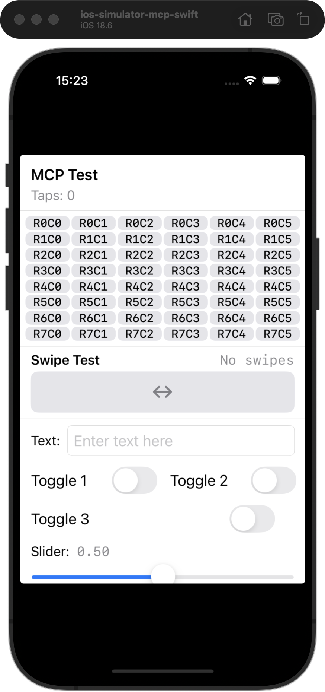
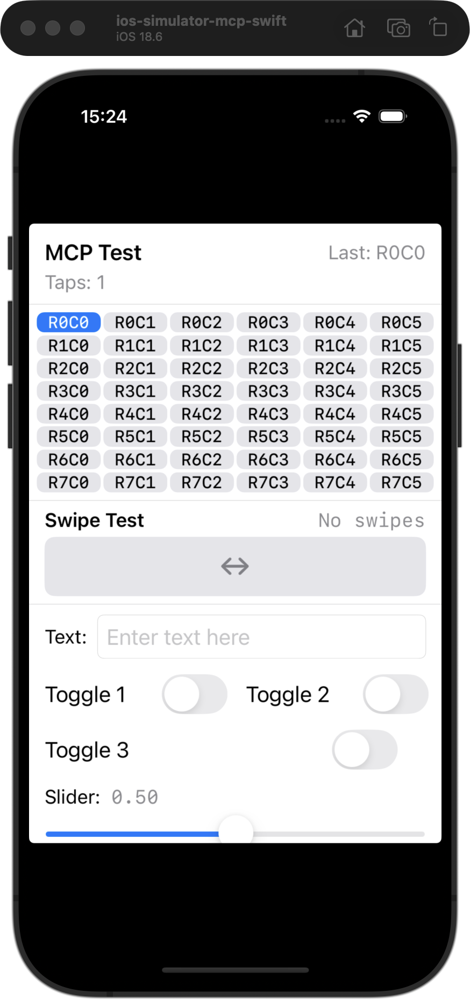
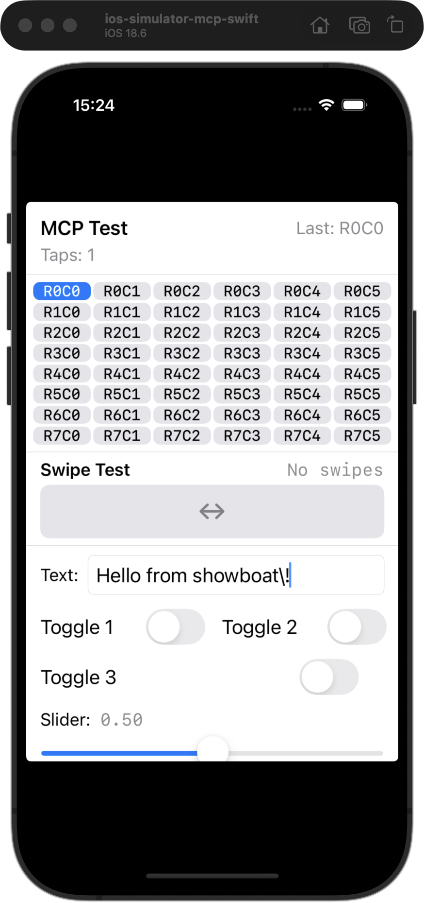
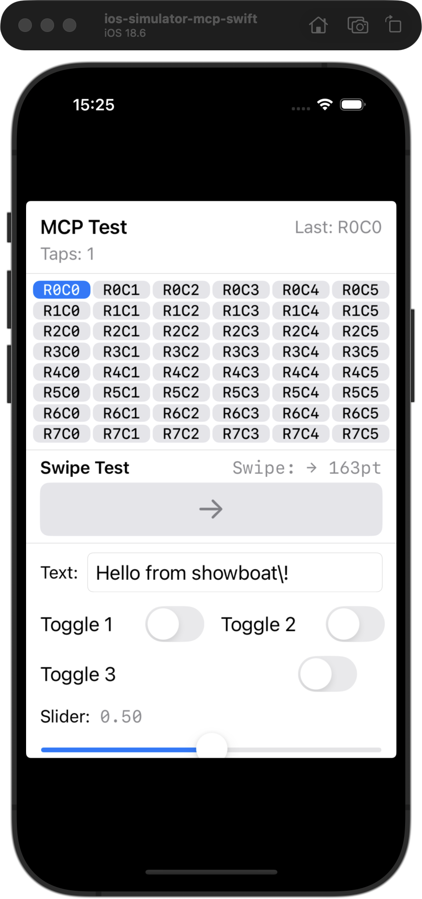

# iOS Simulator CLI — Agent Workflow Demo

*2026-02-18T20:21:11Z by Showboat 0.6.0*
<!-- showboat-id: 6c86bcc2-06ff-4db1-bc8d-f3fdba13e244 -->

**ios-simulator-mcp-swift** is a native Swift CLI that controls iOS Simulator — tapping, typing, swiping, reading the accessibility tree, and capturing screenshots. It talks directly to Apple's private frameworks (IndigoHID, CoreSimulator) for low-latency input injection, making it fast enough for real-time agent loops.

This demo walks through the core agent cycle: **screenshot → read AX tree → interact → verify**.

## 1. Discover the target simulator

First, find our target simulator's UDID. When multiple simulators are booted, we need to be explicit about which one to control.

```bash
xcrun simctl list devices booted | grep ios-simulator-mcp-swift
```

```output
    ios-simulator-mcp-swift (6C07B68F-054D-434D-B5D7-6C52DCE7D78B) (Booted) 
```

We'll use this UDID for all subsequent commands. Let's also set up a shell variable for convenience.

```bash
UDID=6C07B68F-054D-434D-B5D7-6C52DCE7D78B && echo "Target UDID: $UDID"
```

```output
Target UDID: 6C07B68F-054D-434D-B5D7-6C52DCE7D78B
```

## 2. Screenshot — see what's on screen

`ui_view` captures a screenshot. The output image is coordinate-aligned: 1 pixel = 1 iOS point, so coordinates from the AX tree map directly to pixel positions.

```bash
UDID=6C07B68F-054D-434D-B5D7-6C52DCE7D78B && .build/release/ios_simulator_cli ui_view --udid $UDID --output /tmp/showboat_01_initial.png 2>/dev/null
```

```output
Screenshot saved to /tmp/showboat_01_initial.png
```

```bash {image}
/tmp/showboat_01_initial.png
```



## 3. Read the accessibility tree

`ui_describe_all` dumps the full accessibility tree. Each node shows its role, label, and position as **(center±half-size)** — the center value is the tap target. This is how agents discover what's on screen and where to interact.

```bash
UDID=6C07B68F-054D-434D-B5D7-6C52DCE7D78B && .build/release/ios_simulator_cli ui_describe_all --udid $UDID 2>/dev/null | head -20
```

```output
AXApplication "MCPTestApp" (197±197, 426±295)
  AXStaticText "MCP Test" (61±46, 159±12)
  AXStaticText "Tap count 0" (45±31, 187±11)
  AXButton "Row 0 Column 0" (38±31, 225±10)
  AXButton "Row 0 Column 1" (101±31, 225±10)
  AXButton "Row 0 Column 2" (165±31, 225±10)
  AXButton "Row 0 Column 3" (228±31, 225±10)
  AXButton "Row 0 Column 4" (292±31, 225±10)
  AXButton "Row 0 Column 5" (355±31, 225±10)
  AXButton "Row 1 Column 0" (38±31, 247±10)
  AXButton "Row 1 Column 1" (101±31, 247±10)
  AXButton "Row 1 Column 2" (165±31, 247±10)
  AXButton "Row 1 Column 3" (228±31, 247±10)
  AXButton "Row 1 Column 4" (292±31, 247±10)
  AXButton "Row 1 Column 5" (355±31, 247±10)
  AXButton "Row 2 Column 0" (38±31, 269±10)
  AXButton "Row 2 Column 1" (101±31, 269±10)
  AXButton "Row 2 Column 2" (165±31, 269±10)
  AXButton "Row 2 Column 3" (228±31, 269±10)
  AXButton "Row 2 Column 4" (292±31, 269±10)
```

## 4. Tap a button

The AX tree shows "Row 0 Column 0" at center **(38, 225)**. Let's tap it and verify the tap counter increments.

```bash
UDID=6C07B68F-054D-434D-B5D7-6C52DCE7D78B && .build/release/ios_simulator_cli ui_tap --x 38 --y 225 --udid $UDID 2>/dev/null
```

```output
Tapped successfully
```

Verify by capturing a screenshot — the tap counter should now read "Tap count 1" (was 0).

```bash
UDID=6C07B68F-054D-434D-B5D7-6C52DCE7D78B && .build/release/ios_simulator_cli ui_view --udid $UDID --output /tmp/showboat_02_after_tap.png 2>/dev/null
```

```output
Screenshot saved to /tmp/showboat_02_after_tap.png
```

```bash {image}
/tmp/showboat_02_after_tap.png
```



## 5. Inspect a specific point

`ui_describe_point` returns the accessibility element at any coordinate — useful for verifying what's at a location without dumping the full tree.

```bash
UDID=6C07B68F-054D-434D-B5D7-6C52DCE7D78B && .build/release/ios_simulator_cli ui_describe_point --x 45 --y 187 --udid $UDID 2>/dev/null
```

```output
AXStaticText "Tap count 1" (44±29, 187±11)
```

## 6. Type into a text field

The AX tree showed `AXTextField "Text input field"` at center **(222, 524)**. We tap it to focus, then use `ui_type` to enter text via the pasteboard.

```bash
UDID=6C07B68F-054D-434D-B5D7-6C52DCE7D78B && .build/release/ios_simulator_cli ui_tap --x 222 --y 524 --udid $UDID 2>/dev/null && sleep 0.3 && .build/release/ios_simulator_cli ui_type --text "Hello from showboat\!" --udid $UDID 2>/dev/null
```

```output
Tapped successfully
Typed successfully
```

```bash
UDID=6C07B68F-054D-434D-B5D7-6C52DCE7D78B && .build/release/ios_simulator_cli ui_view --udid $UDID --output /tmp/showboat_03_after_type.png 2>/dev/null
```

```output
Screenshot saved to /tmp/showboat_03_after_type.png
```

```bash {image}
/tmp/showboat_03_after_type.png
```



## 7. Swipe gesture

The AX tree has a `AXGenericElement "Swipe area"` at center **(197, 458)**. We'll swipe right across it using `ui_swipe`.

```bash
UDID=6C07B68F-054D-434D-B5D7-6C52DCE7D78B && .build/release/ios_simulator_cli ui_swipe --x-start 100 --y-start 458 --x-end 300 --y-end 458 --udid $UDID 2>/dev/null
```

```output
Swiped successfully
```

Verify the swipe registered in the UI and confirm via the AX tree:

```bash
UDID=6C07B68F-054D-434D-B5D7-6C52DCE7D78B && .build/release/ios_simulator_cli ui_describe_point --x 327 --y 413 --udid $UDID 2>/dev/null
```

```output
AXStaticText "Swipe: → 163pt" (298±80, 413±11)
```

```bash
UDID=6C07B68F-054D-434D-B5D7-6C52DCE7D78B && .build/release/ios_simulator_cli ui_view --udid $UDID --output /tmp/showboat_04_final.png 2>/dev/null
```

```output
Screenshot saved to /tmp/showboat_04_final.png
```

```bash {image}
/tmp/showboat_04_final.png
```



## Summary

This demo walked through the core agent loop with **ios-simulator-mcp-swift**:

1. **Discover** — found the target simulator by UDID
2. **Screenshot** — captured the screen with `ui_view` (coordinate-aligned, 1px = 1pt)
3. **Read AX tree** — dumped UI structure with `ui_describe_all` (center±half-size format)
4. **Tap** — tapped a button at coordinates from the AX tree, verified the counter incremented
5. **Inspect** — used `ui_describe_point` to check a specific element without a full tree dump
6. **Type** — focused a text field and injected text via `ui_type`
7. **Swipe** — performed a swipe gesture with `ui_swipe`, verified via AX tree

All commands accept `--udid` for multi-simulator environments. The CLI also runs as an MCP server (`ios_simulator_cli mcp`) for direct agent integration.

Re-run this demo with `showboat verify demos/ios-simulator-cli-demo.md` to confirm all outputs still match.
