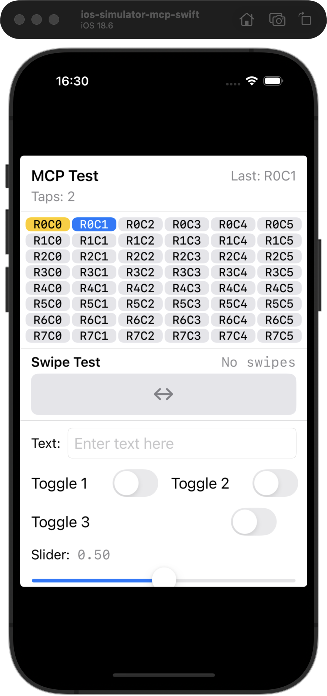
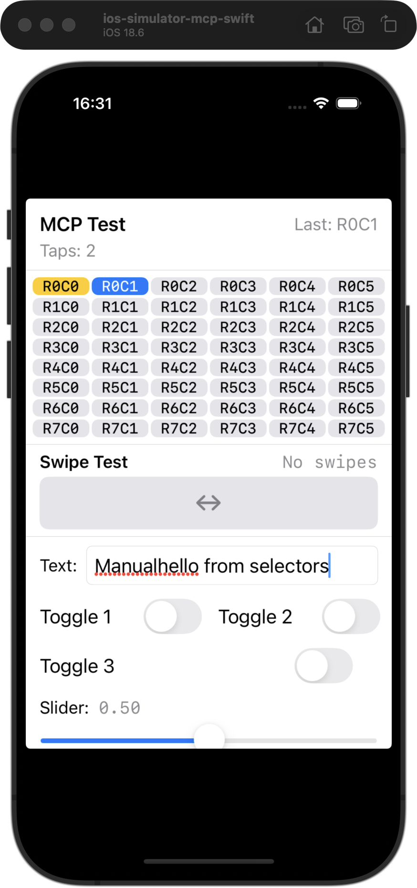

# Selector Commands — From 3 Steps to 1

*2026-02-18T21:29:53Z by Showboat 0.6.0*
<!-- showboat-id: 64a9ff36-a3c2-480a-a7dc-3ad92e7f28c7 -->

**iosef** now supports selector-based commands that let agents find, query, and interact with accessibility elements by role, name, or identifier — no manual coordinate extraction needed.

This demo contrasts the old coordinate-based workflow with the new selector commands, running against MCPTestApp.

## 1. Setup — discover the target simulator

```bash
xcrun simctl list devices booted | grep ios-simulator-mcp-swift
```

```output
    ios-simulator-mcp-swift (6C07B68F-054D-434D-B5D7-6C52DCE7D78B) (Booted) 
```

```bash
UDID=6C07B68F-054D-434D-B5D7-6C52DCE7D78B && echo "Target UDID: $UDID"
```

```output
Target UDID: 6C07B68F-054D-434D-B5D7-6C52DCE7D78B
```

## 2. Old way: 3-step tap

To tap a button, agents had to: (1) dump the full AX tree, (2) visually parse it to find the element and its coordinates, (3) tap those coordinates.

```bash
UDID=6C07B68F-054D-434D-B5D7-6C52DCE7D78B && .build/release/iosef describe_all --udid $UDID 2>/dev/null | head -8
```

```output
AXApplication "MCPTestApp" (197±197, 426±295)
  AXStaticText "MCP Test" (61±46, 159±12)
  AXStaticText "Tap count 0" (45±31, 187±11)
  AXButton "Row 0 Column 0" (38±31, 225±10)
  AXButton "Row 0 Column 1" (101±31, 225±10)
  AXButton "Row 0 Column 2" (165±31, 225±10)
  AXButton "Row 0 Column 3" (228±31, 225±10)
  AXButton "Row 0 Column 4" (292±31, 225±10)
```

The agent must parse the tree to find "Row 0 Column 0" at center (38, 225), then issue a separate tap:

```bash
UDID=6C07B68F-054D-434D-B5D7-6C52DCE7D78B && .build/release/iosef tap --x 38 --y 225 --udid $UDID 2>/dev/null
```

```output
Tapped successfully
```

That's **3 steps** (describe_all → parse → tap) for one interaction.

## 3. New way: `find`

`find` searches the AX tree by selector and returns only matching nodes.

```bash
UDID=6C07B68F-054D-434D-B5D7-6C52DCE7D78B && .build/release/iosef find --role AXButton --name "Row 0" --udid $UDID 2>/dev/null
```

```output
AXButton "Row 0 Column 0" (38±31, 225±10)
AXButton "Row 0 Column 1" (101±31, 225±10)
AXButton "Row 0 Column 2" (165±31, 225±10)
AXButton "Row 0 Column 3" (228±31, 225±10)
AXButton "Row 0 Column 4" (292±31, 225±10)
AXButton "Row 0 Column 5" (355±31, 225±10)
```

## 4. New way: `tap_element`

`tap_element` combines find + tap into one command. No coordinate extraction needed.

```bash
UDID=6C07B68F-054D-434D-B5D7-6C52DCE7D78B && .build/release/iosef tap_element --name "Row 0 Column 1" --udid $UDID 2>/dev/null
```

```output
Tapped element at (101, 225)
```

That's **1 step** instead of 3. Let's verify the counter incremented:

```bash
UDID=6C07B68F-054D-434D-B5D7-6C52DCE7D78B && .build/release/iosef view --udid $UDID --output /tmp/showboat_sel_01_tap_element.png 2>/dev/null
```

```output
Screenshot saved to /tmp/showboat_sel_01_tap_element.png
```

```bash {image}
/tmp/showboat_sel_01_tap_element.png
```



## 5. `exists` + `count`

Quick boolean and numeric queries without parsing tree output.

```bash
UDID=6C07B68F-054D-434D-B5D7-6C52DCE7D78B && .build/release/iosef exists --name "Tap count" --udid $UDID 2>/dev/null
```

```output
true
```

```bash
UDID=6C07B68F-054D-434D-B5D7-6C52DCE7D78B && .build/release/iosef count --role AXButton --udid $UDID 2>/dev/null
```

```output
48
```

## 6. `text` — extract element content

Get the text content of an element as plain text, without parsing markdown output.

```bash
UDID=6C07B68F-054D-434D-B5D7-6C52DCE7D78B && .build/release/iosef text --name "Tap count" --udid $UDID 2>/dev/null
```

```output
Tap count 2
```

## 7. Old way: 3-step input

Typing into a field required tap → sleep → type, with manual coordinates.

```bash
UDID=6C07B68F-054D-434D-B5D7-6C52DCE7D78B && .build/release/iosef tap --x 222 --y 524 --udid $UDID 2>/dev/null && sleep 0.3 && .build/release/iosef type --text "manual" --udid $UDID 2>/dev/null
```

```output
Tapped successfully
Typed successfully
```

## 8. New way: `input`

`input` combines find + tap + type. One command, no coordinates.

```bash
UDID=6C07B68F-054D-434D-B5D7-6C52DCE7D78B && .build/release/iosef input --role AXTextField --text "hello from selectors" --udid $UDID 2>/dev/null
```

```output
Tapped (221, 524) and typed "hello from selectors"
```

```bash
UDID=6C07B68F-054D-434D-B5D7-6C52DCE7D78B && .build/release/iosef view --udid $UDID --output /tmp/showboat_sel_02_input.png 2>/dev/null
```

```output
Screenshot saved to /tmp/showboat_sel_02_input.png
```

```bash {image}
/tmp/showboat_sel_02_input.png
```



## 9. `wait` — poll for UI state

After an interaction, `wait` polls until the expected element appears. Let's tap another button and wait for the counter to update.

```bash
UDID=6C07B68F-054D-434D-B5D7-6C52DCE7D78B && .build/release/iosef tap_element --name "Row 0 Column 2" --udid $UDID 2>/dev/null && .build/release/iosef wait --name "Tap count 3" --timeout 5 --udid $UDID 2>/dev/null
```

```output
Tapped element at (164, 225)
AXStaticText "Tap count 3" (45±31, 187±11)
```

## 10. `describe_all --depth` — control tree verbosity

Limit tree depth to see just the top-level structure.

```bash
UDID=6C07B68F-054D-434D-B5D7-6C52DCE7D78B && .build/release/iosef describe_all --depth 0 --udid $UDID 2>/dev/null
```

```output
AXApplication "MCPTestApp" (197±197, 426±295)
```

Depth 0 shows only the root. Depth 1 shows direct children too:

```bash
UDID=6C07B68F-054D-434D-B5D7-6C52DCE7D78B && .build/release/iosef describe_all --depth 1 --udid $UDID 2>/dev/null | head -6
```

```output
AXApplication "MCPTestApp" (197±197, 426±295)
  AXStaticText "MCP Test" (61±46, 159±12)
  AXStaticText "Last tapped Row 0 Column 2" (332±46, 159±11)
  AXStaticText "Tap count 3" (45±31, 187±11)
  AXButton "Row 0 Column 0" (38±31, 225±10)
  AXButton "Row 0 Column 1" (101±31, 225±10)
```

## Summary

| Workflow | Old way | New way |
|---|---|---|
| Tap a named button | `describe_all` → parse → `tap` (3 steps) | `tap_element --name "..."` (1 step) |
| Type into a field | `describe_all` → parse → `tap` → sleep → `type` (5 steps) | `input --role AXTextField --text "..."` (1 step) |
| Check if element exists | `describe_all` → parse output (2 steps) | `exists --name "..."` (1 step) |
| Get element text | `describe_all` → parse output (2 steps) | `text --name "..."` (1 step) |
| Wait for UI change | Manual polling loop (N steps) | `wait --name "..." --timeout 5` (1 step) |
| Count elements | `describe_all --json` → jq filter (2 steps) | `count --role AXButton` (1 step) |

All selector commands accept `--role`, `--name`, and `--identifier` (AND logic). They work in both CLI and MCP server modes.
